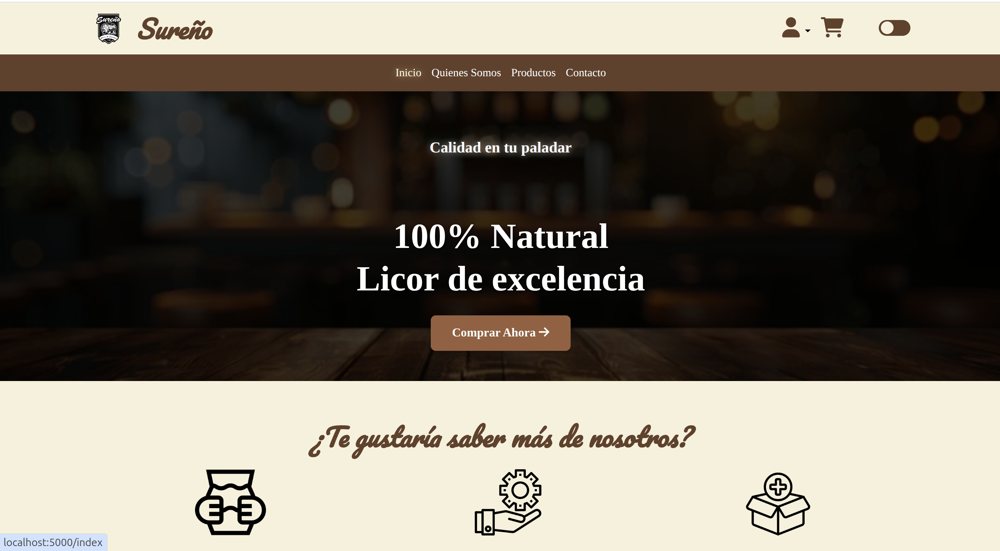
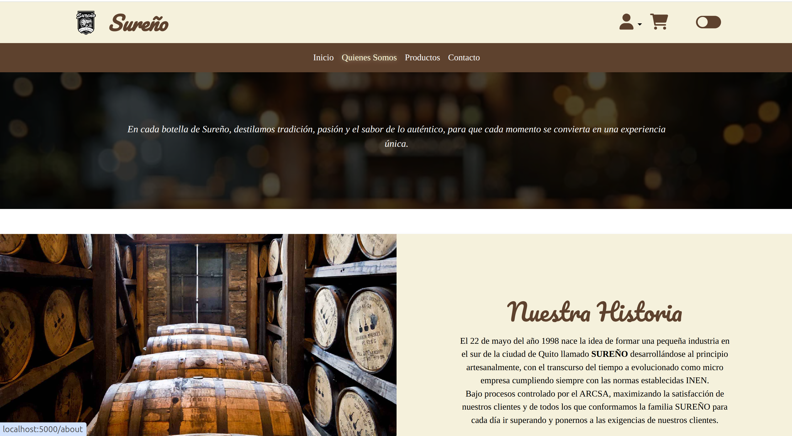
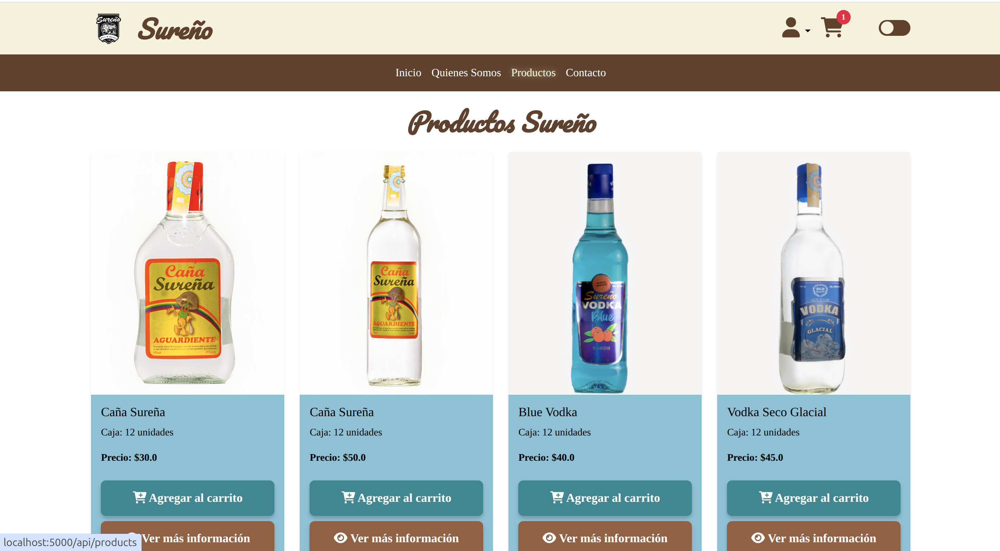

# Sureño

Sureño es un sitio web de comercio electrónico para la empresa Sureño, la cual se encarga de vender licores de su marca. El proyecto fue desarrollado utilizando el framework Flask de Python con una arquitectura modular y escalable. Este proyecto proporciona una plataforma donde los usuarios pueden explorar, seleccionar y comprar productos de manera sencilla y eficiente.





## Arquitectura del Proyecto

Este proyecto sigue una **arquitectura en capas** (Layered Architecture) con separación clara de responsabilidades:

```
Capa de Presentación (Routes/Templates)
           ↓
Capa de Negocio (Services)
           ↓
Capa de Datos (Models/Database)
```

Para más detalles, consulta:

- [Arquitectura del Backend](ARCHITECTURE.md)
- [Arquitectura del Frontend](FRONTEND_ARCHITECTURE.md)

## Estructura del Proyecto

```
Sureno/
├── app.py                 # Punto de entrada de la aplicación
├── config.py              # Configuración y variables de entorno
├── constants.py           # Constantes de la aplicación
├── models/                # Modelos de datos (MongoDB)
├── services/              # Lógica de negocio
│   ├── auth_service.py
│   ├── user_service.py
│   ├── product_service.py
│   ├── cart_service.py
│   └── order_service.py
├── routes/                # Controladores y endpoints
│   ├── auth_routes.py
│   ├── user_routes.py
│   ├── product_routes.py
│   ├── cart_routes.py
│   └── order_routes.py
├── utils/                 # Utilidades reutilizables
│   ├── decorators.py      # Decoradores de autenticación
│   ├── validators.py      # Validaciones
│   ├── file_handler.py    # Manejo de archivos
│   └── response_handler.py # Respuestas estandarizadas
├── static/                # Recursos estáticos
│   ├── css/               # Estilos modulares
│   │   ├── _variables.css
│   │   ├── _base.css
│   │   ├── _components.css
│   │   └── main.css
│   └── js/                # JavaScript modular
│       ├── utils/         # Utilidades (API, Storage, Validation)
│       └── modules/       # Módulos (Cart, Auth, Products)
└── templates/             # Plantillas HTML
```

## Partes del Sitio

- **Clientes**: Los clientes pueden registrarse, navegar por los productos, añadirlos al carrito y realizar compras.
- **Administradores**: Los administradores tienen acceso a un panel de control donde pueden gestionar todos los aspectos del sitio, incluyendo la gestión de productos y la visualización de pedidos.

## Credenciales de Acceso

- **Administrador**:

  - **Usuario**: adminSureno@gmail.com
  - **Contraseña**: admin1

- **Cliente**:
  - **Usuario**: ingresoSureno@gmail.com
  - **Contraseña**: ingreso1

## Características

### Backend

- **Arquitectura en Capas**: Separación clara entre presentación, lógica de negocio y datos
- **Service Layer**: Toda la lógica de negocio encapsulada en servicios reutilizables
- **Decoradores de Autenticación**: `@login_required` y `@admin_required` para proteger rutas
- **Validación Centralizada**: Sistema de validación reutilizable para todos los endpoints
- **Manejo de Errores**: Respuestas de error estandarizadas y consistentes
- **Gestión de Archivos**: Subida y validación de imágenes de productos

### Frontend

- **CSS Modular**: Sistema de diseño con variables CSS y componentes reutilizables
- **JavaScript Modular**: Utilidades y módulos independientes (Cart, Auth, Products)
- **Tema Claro/Oscuro**: Sistema de temas con persistencia en localStorage
- **Responsive Design**: Adaptable a todos los tamaños de pantalla
- **Validación del Cliente**: Validación de formularios antes de enviar al servidor
- **Notificaciones**: Sistema de notificaciones elegante con SweetAlert2

### Funcionalidad de Usuario

- **Registro y Autenticación**: Sistema robusto de login con roles (Admin/Cliente)
- **Gestión de Productos**: CRUD completo de productos (solo administradores)
- **Carrito de Compras**: Gestión de carrito con persistencia
- **Proceso de Checkout**: Flujo de compra con cálculo de envío
- **Historial de Pedidos**: Consulta de pedidos anteriores
- **Gestión de Direcciones**: Múltiples direcciones de envío por usuario

## Tecnologías Utilizadas

### Backend

- **Python 3.10+**
- **Flask 3.1.0**: Framework web
- **PyMongo 4.10.1**: Cliente de MongoDB
- **bcrypt 4.2.1**: Hashing de contraseñas
- **python-dotenv**: Variables de entorno

### Frontend

- **HTML5 & CSS3**
- **JavaScript (ES6+)**
- **Bootstrap 5**: Framework CSS
- **SweetAlert2**: Notificaciones
- **Font Awesome**: Iconos

### Base de Datos

- **MongoDB Atlas**: Base de datos NoSQL en la nube

### Arquitectura y Patrones

- **Layered Architecture**: Separación en capas (Presentación, Negocio, Datos)
- **Service Layer Pattern**: Lógica de negocio encapsulada
- **Repository Pattern**: Acceso a datos abstraído
- **Decorator Pattern**: Autenticación y autorización
- **SOLID Principles**: Código mantenible y escalable

## Instalación

Para instalar y ejecutar el proyecto en tu máquina local, sigue estos pasos:

1. **Clona el repositorio**:

   ```bash
   git clone https://github.com/luis-sagx/Sureno.git
   cd Sureno
   ```

2. **Crea un entorno virtual** (recomendado):

   ```bash
   python -m venv venv
   source venv/bin/activate  # En Windows: venv\Scripts\activate
   ```

3. **Instala las dependencias**:

   ```bash
   pip install -r requirements.txt
   ```

4. **Configura las variables de entorno**:

5. **Configura las variables de entorno**:

   **⚠️ IMPORTANTE - SEGURIDAD**:

   - El archivo `.env` ya existe con las credenciales del proyecto
   - Este archivo está en `.gitignore` y NUNCA debe compartirse o subirse a Git
   - Contiene información sensible como la URI de MongoDB

   Si necesitas cambiar las credenciales, edita el archivo `.env` en la raíz:

   ```env
   SECRET_KEY=tu_clave_secreta_aqui
   MONGO_URI=tu_uri_de_mongodb_atlas
   DATABASE_NAME=Sureno
   FLASK_ENV=development
   ```

6. **Ejecuta la aplicación**:

   ```bash
   python app.py
   ```

7. **Accede a la aplicación**:

   Abre tu navegador en `http://localhost:5000`

## API Endpoints

### Autenticación

- `POST /api/auth/login` - Iniciar sesión
- `POST /api/auth/register` - Registrar usuario
- `POST /api/auth/logout` - Cerrar sesión
- `GET /api/user` - Obtener usuario actual

### Productos

- `GET /api/products` - Listar todos los productos
- `GET /api/products/<id>` - Obtener producto por ID
- `POST /api/products` - Crear producto (Admin)
- `PUT /api/products/<id>` - Actualizar producto (Admin)
- `DELETE /api/products/<id>` - Eliminar producto (Admin)
- `POST /api/products/upload-image/<id>` - Subir imagen de producto (Admin)

### Carrito

- `GET /api/cart` - Obtener carrito del usuario
- `POST /api/cart` - Guardar carrito
- `PUT /api/cart` - Actualizar carrito
- `DELETE /api/cart` - Eliminar carrito

### Pedidos

- `GET /api/orders` - Obtener pedidos del usuario
- `GET /api/orders/<id>` - Obtener pedido por ID
- `POST /api/orders` - Crear pedido
- `PUT /api/orders/<id>` - Actualizar estado de pedido (Admin)
- `DELETE /api/orders/<id>` - Cancelar pedido

### Direcciones

- `GET /api/addresses` - Obtener direcciones del usuario
- `POST /api/addresses` - Crear dirección
- `PUT /api/addresses/<id>` - Actualizar dirección
- `DELETE /api/addresses/<id>` - Eliminar dirección

## Uso

### Para Clientes

1. **Registro**: Navega a `/signUp` y completa el formulario de registro
2. **Login**: Inicia sesión en `/login` con tus credenciales
3. **Explorar Productos**: Navega por el catálogo en `/api/products`
4. **Agregar al Carrito**: Haz clic en "Agregar al carrito" en los productos que desees
5. **Ver Carrito**: Accede a `/cart` para revisar tu selección
6. **Checkout**: Procede al pago en `/checkOut`
7. **Mis Compras**: Consulta tu historial en `/compras`

### Para Administradores

1. **Login Admin**: Inicia sesión con credenciales de administrador
2. **Dashboard**: Accede al panel de control en `/admin/dashboard`
3. **Gestión de Productos**:
   - Ver todos: `/admin/products`
   - Crear: Haz clic en "Nuevo Producto"
   - Editar: Haz clic en el ícono de editar
   - Eliminar: Haz clic en el ícono de eliminar
4. **Gestión de Pedidos**: Ver y actualizar pedidos en `/admin/orders`

## Licencia

Este proyecto esta bajo [MIT License](LICENSE).

## Contacto

Para consultas o soporte, contacta a: info@sureno.com
